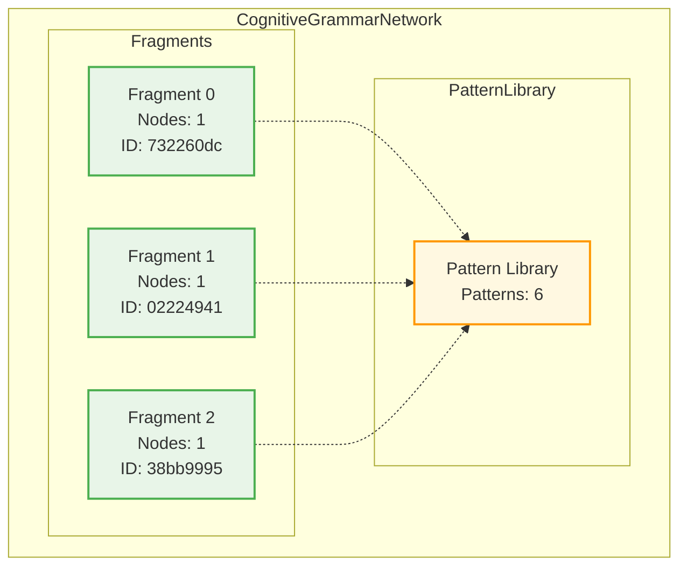
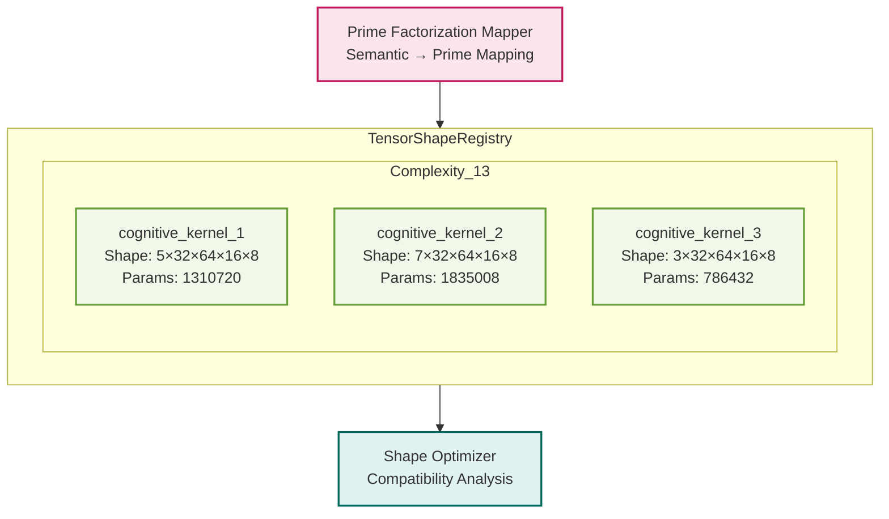
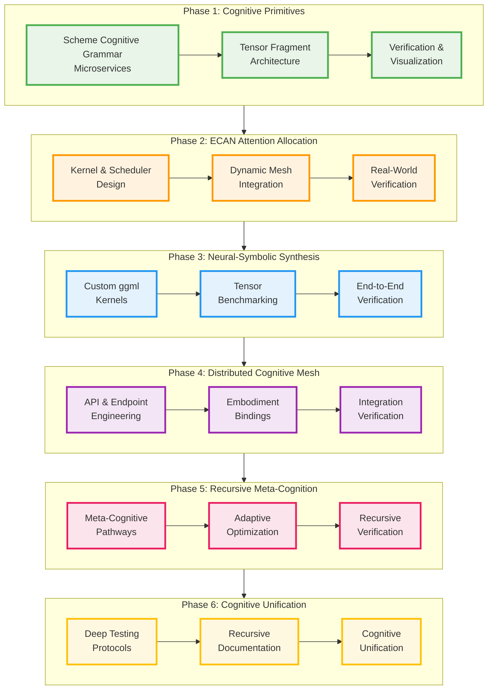

# Distributed Agentic Cognitive Grammar Network Architecture

## Overview

The Distributed Agentic Cognitive Grammar Network is a novel architecture that bridges
symbolic reasoning and neural computation through RWKV-based tensor operations.

## Network Architecture



## Tensor Shape Registry



## Implementation Phases



## Current Network Status

- **Total Fragments**: 3
- **Total Nodes**: 3
- **Pattern Library Size**: 6
- **Device**: cpu
- **AtomSpace Integration**: False

## Registry Statistics


- **Total Kernels**: 3
- **Total Parameters**: 3,932,160
- **Average Complexity**: 13.90
- **Modality Distribution**: {2: 1, 3: 1, 1: 1}


## API Reference

### Core Classes

#### CognitiveGrammarNetwork
Main orchestrator for the distributed cognitive grammar network.

```python
network = CognitiveGrammarNetwork(device='cpu')
fragment = network.create_agentic_fragment('test_agent')
```

#### TensorFragment
Encodes agents/states as hypergraph nodes & links with tensor representations.

```python
fragment = TensorFragment(device='cpu')
node = HypergraphNode(node_type='cognitive_entity')
fragment.add_node(node)
```

#### TensorShapeRegistry
Manages tensor shapes and their prime factorization mappings.

```python
registry = TensorShapeRegistry()
kernel_shape = KernelTensorShape(...)
registry.register_kernel_shape(kernel_shape)
```

## Usage Examples

### Basic Network Creation

```python
from cognitive_grammar import CognitiveGrammarNetwork, ModalityType

# Create network
network = CognitiveGrammarNetwork()

# Create agentic fragment
fragment = network.create_agentic_fragment(
    agent_type="linguistic_agent",
    modality=ModalityType.LINGUISTIC,
    depth=4,
    context=8
)

# Register fragment
fragment_id = network.register_fragment(fragment)
```

### Scheme Grammar Processing

```python
from cognitive_grammar.adapters import SchemeAdapter

# Create adapter
adapter = SchemeAdapter()

# Parse agentic grammar
grammar_text = "(action move (agent robot) (target location))"
fragments = adapter.parse_agentic_grammar(grammar_text)
```

### Tensor Shape Management

```python
from cognitive_grammar.tensor_registry import TensorShapeRegistry, PrimeFactorizationMapper

# Create registry
registry = TensorShapeRegistry()

# Create mapper
mapper = PrimeFactorizationMapper()

# Suggest kernel shapes
suggestions = mapper.suggest_kernel_shapes(
    function_complexity=3,
    input_modalities=[ModalityType.LINGUISTIC],
    output_requirements={'context_size': 16}
)
```

## Verification and Testing

The framework includes comprehensive verification:

- Pattern transformation tests
- Hypergraph integrity verification  
- Bidirectional translation consistency
- Tensor-hypergraph correspondence

```python
from cognitive_grammar.verification import ComprehensiveVerificationSuite

# Create verification suite
verifier = ComprehensiveVerificationSuite()
verifier.setup_default_tests()

# Run verification
report = verifier.run_full_verification_suite(network)
print(f"Success rate: {report.success_rate:.2%}")
```

## Next Steps: Phase 2 Implementation

1. **ECAN Attention Allocation**: Implement resource allocators
2. **Dynamic Mesh Integration**: Benchmark attention allocation
3. **Real-World Verification**: Schedule real tasks with live data

## Contributing

This is Phase 1 of a 6-phase implementation. Each phase builds upon the 
foundational architecture established here.

Generated on: 2025-07-13 23:56:44
